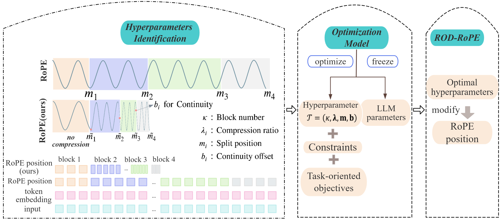

# ROD-RoPE

Official implementation of the paper:

**Optimization-Driven Framework for Long-Context Extrapolation Without Fine-Tuning LLMs**

ROD-RoPE is the codebase for the paper **Optimization-Driven Framework for Long-Context Extrapolation Without Fine-Tuning LLMs**. The project implements a training-free RoPE position-remapping method for extending the context window of RoPE-based large language models, together with Bayesian optimization scripts for selecting high-performing ROD-RoPE hyperparameters. 

The experiments in this repository use 
- **Llama-2-7B-Chat**
- **Llama-3-8B-Instruct**
- **Mistral-7B-Instruct**


## Overview

RoPE-based LLMs often degrade when the inference length exceeds the context window observed during pretraining. ROD-RoPE reduces this positional distribution shift by transforming only the RoPE positional indices, while leaving the token embeddings and model parameters unchanged.

The method divides the RoPE positional indices into multiple blocks. The first block is left uncompressed, while later blocks use different compression ratios. Continuity-preserving offsets are introduced so that the transformed positions remain continuous at block boundaries.

For a position \(p\) in block \(i\), the transformed RoPE position is

\[
\widetilde{p}=\lambda_i p+b_i,
\]

where:

- \(\lambda_i\) is the compression ratio of block \(i\);
- \(b_i\) is the continuity offset;
- \(m_i\) denotes a block boundary;
- \(\kappa\) denotes the number of blocks.

The complete configuration is

\[
T=(\kappa,\boldsymbol{\lambda},\boldsymbol{m},\boldsymbol{b}).
\]

The first block satisfies

\[
\lambda_1=1,\qquad b_1=0.
\]

The remaining offsets are computed from the continuity condition

\[
b_{i+1}
=
\lambda_i m_i+b_i-\lambda_{i+1}m_i.
\]

Therefore, \(\boldsymbol{b}\) is derived from the block boundaries and compression ratios and does not need to be optimized independently.

## Main Features

- Long-context extension without tuning LLM parameters: ROD-RoPE modifies only RoPE positional indices while keeping the LLM parameters and token representations unchanged.
- Plug-and-play RoPE position remapping through monkey-patched attention forward functions.
- Optimization-driven RoPE configuration discovery via Bayesian optimization with a multi-objective formulation.
- Support for Llama-2-7B-Chat, Llama-3-8B-Instruct, and Mistral-7B-Instruct models.
- Flexible piecewise RoPE transformations with two-, three-, and four-block configurations.
- Evaluation pipelines for Needle-in-a-Haystack, Counting-Stars, Perplexity (PPL), and LongBench benchmarks.

## Method Summary

ROD-RoPE optimizes the hyperparameter tuple:

```text
T = (kappa, lambda, m, b)
```

where:

- `kappa` is the number of position blocks.
- `m = [m0, m1, ..., mk]` are split positions, with `m0 = 0`.
- `lambda = [lambda1, ..., lambdak]` are block-wise position compression slopes in the paper notation.
- `b = [b1, ..., bk]` are offsets computed from continuity constraints.

For a token position `p` in block `i`, the transformed RoPE position is:

```text
p_tilde = lambda_i * p + b_i
```

The first block is kept uncompressed (`lambda1 = 1`, `b1 = 0`) because early tokens carry important contextual information. Offsets are computed so adjacent blocks meet continuously at split boundaries.

Important notation note: in the code, arguments such as `lambda2`, `lambda3`, and `lambda4` are passed as compression/group-size denominators, for example positions are transformed with expressions like `position // lambda2` or `position / lambda2`. This means a paper slope of about `0.1` corresponds to a code compression factor near `10`.

## Repository Layout

```text
Rodrope/
├── Rodrope.py                         # Public entry point: Rodrope.apply(...)
├── Rodrope_patch/                     # Model-specific attention patches
│   ├── Llama.py                       # Llama flash/eager ROD-RoPE attention
│   ├── Mistral.py                     # Mistral ROD-RoPE attention
│   └── Rodrope_flash_attn*.py         # FlashAttention helpers
├── optimization_llama2.py             # BO search for Llama-2-7B-Chat
├── optimization_llama3.py             # BO search for Llama-3-8B-Instruct
├── optimization_mistral.py            # BO search for Mistral-7B-Instruct
├── main_counting_llama2.py            # Counting-Stars evaluation
├── main_counting_llama3.py
├── main_counting_mistral.py
├── main_needle_llama3_ours.py         # Needle-in-a-Haystack evaluation
├── main_longbench_llama3_ours.py      # LongBench evaluation for Llama-3 + ROD-RoPE
├── main_ppl_llama2_ours.py            # PPL evaluation
├── main_ppl_llama3_ours.py
├── main_ppl_mistral_ppl.py
├── context_data/                      # Counting-Stars local context data
├── img/                               # Figures used by paper/project
└── requirements.txt
```

## Installation

The project was developed with `transformers==4.38.2`, PyTorch CUDA 11.8, FlashAttention 2, BoTorch, and GPyTorch.

```bash
cd /ROD-RoPE/Extend_context_window_of_LLM/Rodrope
conda create -n rodrope python=3.11 -y
conda activate rodrope
pip install -r requirements.txt
```

If `flash-attn` cannot be installed directly from `requirements.txt`, install a CUDA/PyTorch-matched wheel manually. The local environment used:

```bash
pip install flash-attn==2.5.6 --no-build-isolation
```

## Quick Start

A minimal example for applying ROD-RoPE to a Hugging Face causal LM:

```python
from transformers import AutoConfig, AutoModelForCausalLM, AutoTokenizer
import torch
import Rodrope

model_path = "/path/to/llama-or-mistral-model"

tokenizer = AutoTokenizer.from_pretrained(model_path, use_fast=True)
config = AutoConfig.from_pretrained(model_path)
model = AutoModelForCausalLM.from_pretrained(
    model_path,
    config=config,
    torch_dtype=torch.bfloat16,
    attn_implementation="flash_attention_2",
    device_map="auto",
)
model.eval()

# Example: Llama-3 32K three-block configuration, using the same
# m/lambda notation as optimization_allblock_llama3.py.
rodrope_config = {
    "rodrope_block": 3,
    "m1": 128,
    "lambda2": 7.09,
    "m2": 12288,
    "lambda3": 32.0,
    "m3": None,
    "lambda4": None,
}

Rodrope.apply(
    model,
    m1=rodrope_config["m1"],
    lambda2=rodrope_config["lambda2"],
    m2=rodrope_config["m2"],
    lambda3=rodrope_config["lambda3"],
    m3=rodrope_config["m3"],
    lambda4=rodrope_config["lambda4"],
    enable_flash_attention=True,
    flash_attention_impl="flash_attn",
    rodrope_block=rodrope_config["rodrope_block"],
)
```

This `Rodrope.apply(...)` block is only a minimal application example. The public API now accepts the same `m1`, `lambda2`, `m2`, `lambda3`, `m3`, and `lambda4` names used by the experiment scripts, while keeping the older `group_size/window_size/far_size/far_group_size` names backward-compatible. In BO runs, these values are searched by `optimization_llama3.py`; in standalone Counting-Stars runs, they come from `COUNTING_CONFIGS` or the matching CLI arguments.

The experiments in this project use Llama-2-7B-Chat, Llama-3-8B-Instruct, and Mistral-7B-Instruct. For Llama models, `block=2`, `block=3`, and `block=4` are implemented in the flash-attention path. For Mistral, this codebase currently supports `block=2` and `block=3`; set optimization/evaluation runs accordingly.

## Bayesian Optimization

The objective is treated as an expensive black-box function. ROD-RoPE uses Gaussian-process Bayesian optimization with the Expected Improvement (EI) acquisition function.

Because the dimensionality of the split positions and compression ratios depends on the number of blocks, the implementation:

1. enumerates the block number \(\kappa\) in an outer loop;
2. optimizes the remaining variables for each fixed \(\kappa\);
3. returns the best observed configuration.

- Initial sample size: `INITIAL_SAMPLE_SIZE = 10`
- Inner BO iterations: `INNER_ITERATIONS = 50`
- Objective: `F = acquisition + reasoning`

Run one of:

```bash
python optimization_llama2.py
python optimization_llama3.py
python optimization__mistral.py
```

Default target context lengths are:

| Model | Script | Target length |
| --- | --- | --- |
| Llama-2-7B-Chat | `optimization_llama2.py` | 16K |
| Llama-3-8B-Instruct | `optimization_llama3.py` | 32K |
| Mistral-7B-Instruct | `optimization_mistral.py` | 24K |

The optimization-domain dataset is **PaulGrahamEssays**. The optimization objective is computed using the Counting-Stars multi-evidence acquisition and reasoning tasks with 8 inserted facts and 8 test samples.

## Counting-Stars Evaluation

Counting-Stars evaluates multi-evidence retrieval and reasoning. Run:

```bash
python main_counting_llama2.py \
  --model_path /path/to/llama-2-7b-chat \
  --results_root result/counting-stars/llama2

python main_counting_llama3.py \
  --model_path /path/to/Meta-Llama-3-8B-Instruct \
  --results_root result/counting-stars/llama3

python main_counting_mistral.py \
  --model_path /path/to/Mistral-7B-Instruct-v0.1 \
  --results_root result/counting-stars/mistral
```

You can set the ROD-RoPE configuration either by editing `COUNTING_CONFIGS` in the script or by passing command-line arguments such as `--rodrope_block`, `--m1`, `--lambda2`, `--m2`, and `--lambda3` when supported by the script.


## PPL Evaluation

PPL scripts evaluate language modeling perplexity over tokenized datasets with a sliding-window forward pass:

```bash
python main_ppl_llama2_ours.py
python main_ppl_llama3_ours.py
python main_ppl_mistral_ppl.py
```

Common parameters are defined near the top of each script:

- `TOKENIZED_DATASET_PATH`: path to a tokenized dataset directory or parquet files.
- `MIN_TOKENS`, `MAX_TOKENS`, `TOKENS_STEP`: evaluated context lengths.
- `SLIDING_WINDOW`: stride for PPL computation.
- `RODROPE_CONFIGS`: list of ROD-RoPE configurations to evaluate.
- `OUTPUT_CSV`: output file for PPL results.

## Needle-in-a-Haystack Evaluation

`main_needle_llama3_ours.py` runs a pressure test by inserting a target fact into long contexts and checking whether the model retrieves it. The script accepts `-s/--s_len` and `-e/--e_len` for the context-length range. In the current version, the actual ROD-RoPE configurations are read from the `NEEDLE_SE_CONFIGS` list inside the script, so edit that list before running a new configuration.

Example:

```bash
python main_needle_llama3_ours.py \
  --model_path /path/to/Meta-Llama-3-8B-Instruct \
  -s 2048 \
  -e 32768 \
  --rodrope_flash_impl flash_attn
```


## LongBench Evaluation

`main_longbench_llama3_ours.py` evaluates Llama-3-Instruct with ROD-RoPE on LongBench. The LongBench data source is the paper [LongBench: A Bilingual, Multitask Benchmark for Long Context Understanding](https://aclanthology.org/2024.acl-long.172/). By default, the script reads the local LongBench config files and jsonl data from `/LongBench-main`, and writes predictions under this repository's `pred_longbench/` directory so the original LongBench project is not modified.

Example:

```bash
python main_longbench_llama3_ours.py \
  --datasets narrativeqa qasper gov_report \
  --model_path /path/to/meta-llamaMeta-Llama-3-8B-Instruct \
  --max_length 32768 \
  --rodrope_block 3 \
  --m1 256 \
  --lambda2 6.85 \
  --m2 4096 \
  --lambda3 16.0 \
  --evaluate
```

Useful options:

- `--e`: run LongBench-E instead of the standard LongBench split.
- `--resume`: continue from existing prediction jsonl files.
- `--eval_only`: score existing predictions without loading the model.
- `--samples`: evaluate only the first N samples per dataset for debugging.


## Citation

If you use this repository, please cite the accompanying paper:

```bibtex
@article{rodrope,
  title={Optimization-Driven Framework for Long-Context Extrapolation Without Fine-Tuning LLMs},
  author={Anonymous},
  journal={Preprint},
  year={2026}
}
```

Replace the BibTeX fields with the final publication metadata when available.
